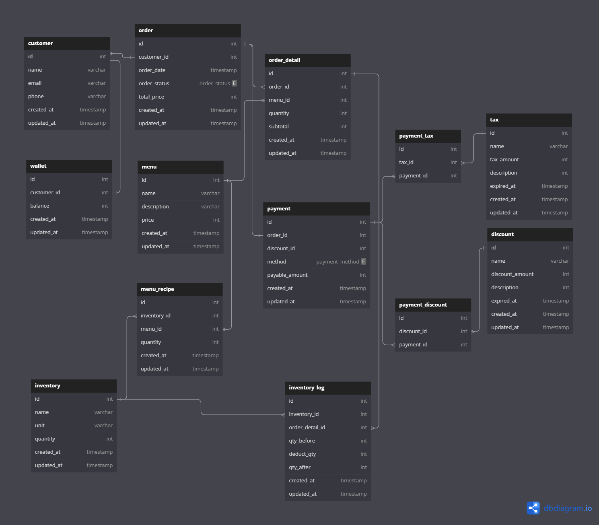

# qoin-technical-test

## I. Theoretical Test

### Diagram
{:target="_blank" rel="noopener noreferrer"}

### Technologies Used
1. **Database Management System (DBMS):** MySQL or PostgreSQL
   - This choice remains the same because MySQL and PostgreSQL are powerful and reliable database management systems. We use the appropriate Go driver to interact with these databases.

2. **Programming Language:** Go (backend)
   - Go (Golang) is used as the programming language for the backend development of our restaurant application. Go offers high performance and is suitable for applications that require speed and efficiency.

3. **Web Frameworks:** Gin and Fiber
   - We use Go web frameworks like Gin and Fiber to simplify backend development. Gin is a well-established framework, while Fiber is a lightweight and high-performance framework.

4. **Frontend Framework:** React or Vue.js (if needed)
   - If you require a responsive and interactive user interface, you can still use React or Vue.js for the frontend, as described earlier.
  
### Additional Features

- **Online Ordering:** Customers can place food orders online through the application, including delivery options.

- **Automatic Stock Management:** Utilizing technologies such as RFID or barcodes to automatically track inventory and update the database as items are sold or used.

- **Mobile Application:** In addition to the web application, we can develop mobile applications for iOS and Android to make it even easier for customers to place orders and view reports.

- **Loyalty Program:** Implement a loyalty program feature to encourage customer retention with special discounts or rewards.

- **Table Reservations:** Allow customers to make table reservations through the application.
